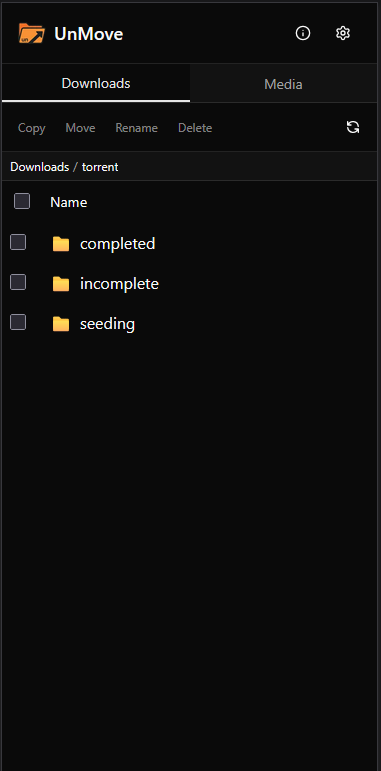
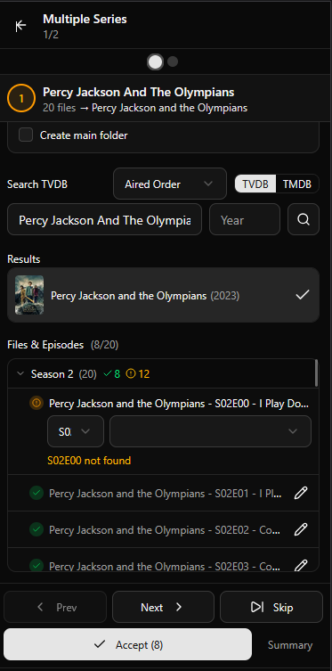

<h1 align="center">
  
  <br>
  UnMove
</h1>

<p align="center">
  <strong>A self-hosted web application to organize your media library by identifying files using TVDB or TMDB and moving them with proper naming conventions</strong>
</p>

<p align="center">
  <a href="https://hub.docker.com/r/yusseiin/unmove"></a>
  <a href="https://github.com/yusseiin/unmove/blob/main/LICENSE"></a>
  <a href="https://github.com/yusseiin/unmove/stargazers"></a>
  <a href="https://github.com/yusseiin/unmove/commits/main"></a>
  <br>
  
  
  
  
  
</p>

<p align="center">
  <a href="#features">Features</a> •
  <a href="#screenshots">Screenshots</a> •
  <a href="#installation">Installation</a> •
  <a href="#configuration">Configuration</a> •
  <a href="#development">Development</a>
</p>

---

## Features

- **File Browser** - Browse your downloads folder with parsed information (title, year, season, episode)
- **TVDB & TMDB Integration** - Search and identify movies/TV shows using TVDB or TMDB APIs
- **Auto-Match** - Automatically matches files to search results based on filename similarity
- **Batch Processing** - Identify and move multiple files at once
- **Multiple TV Series** - Handle episodes from different series in a single workflow
- **Smart Renaming** - Automatically renames files following media server conventions (Plex/Jellyfin/Emby compatible)
- **Configurable Paths** - Set custom download and media library paths

## Screenshots

<p align="center">
  &nbsp;&nbsp;&nbsp;
  &nbsp;&nbsp;&nbsp;
  
</p>

## Installation

### Docker (Recommended - Instant Moves)

For **instant file moves** (no copy+delete), mount downloads and media under the same parent directory:

```bash
docker run -d \
  --name unmove \
  -p 3000:3000 \
  -e PUID=99 \
  -e PGID=100 \
  -v /mnt/user:/data \
  -v /path/to/config:/config \
  -e DOWNLOAD_PATH=/data/downloads \
  -e MEDIA_PATH=/data/media \
  yusseiin/unmove:latest
```

> **Why?** When downloads and media are on the same Docker volume, moving files is instant (just a rename). With separate volumes, Docker must copy the file then delete it.

### Docker Compose (Recommended - Instant Moves)

```yaml
version: "3.8"
services:
  unmove:
    image: yusseiin/unmove:latest
    container_name: unmove
    ports:
      - "3000:3000"
    environment:
      - PUID=99
      - PGID=100
      - DOWNLOAD_PATH=/data/downloads
      - MEDIA_PATH=/data/media
    volumes:
      - /mnt/user:/data          # Single mount for instant moves
      - /path/to/config:/config
    restart: unless-stopped
```

### Docker (Legacy - Separate Volumes)

If you prefer separate volume mounts (moves will copy+delete instead of instant):

```bash
docker run -d \
  --name unmove \
  -p 3000:3000 \
  -e PUID=99 \
  -e PGID=100 \
  -v /path/to/downloads:/downloads \
  -v /path/to/media:/media \
  -v /path/to/config:/config \
  -e DOWNLOAD_PATH=/downloads \
  -e MEDIA_PATH=/media \
  yusseiin/unmove:latest
```

### Unraid

Available in Community Applications. Search for "unmove" or install manually using the Docker Hub image `yusseiin/unmove:latest`.

**For instant moves on Unraid**, use the recommended configuration that mounts `/mnt/user` as a single volume.

> ⚠️ **Important Note about Instant Moves on Unraid**
>
> Even with a single Docker volume mount, instant moves will only work if both the downloads and media folders are on the **same physical disk**. Unraid's `/mnt/user` is a virtual filesystem (shfs/fuse) that spans multiple disks. If your downloads are on `disk1` and media is on `disk2`, the system must copy+delete the file regardless of the Docker configuration.
>
> **To ensure instant moves:**
> - Configure both shares (downloads and media) to use the same disk in Unraid's share settings, OR
> - Mount a specific disk directly: `-v /mnt/disk1:/data` instead of `/mnt/user:/data`
>
> If your files are on different physical disks, the application will automatically fall back to copy+delete (which is slower but works correctly).

## Configuration

### Environment Variables

| Variable | Default | Description |
|----------|---------|-------------|
| `PUID` | 99 | User ID for file permissions |
| `PGID` | 100 | Group ID for file permissions |
| `DOWNLOAD_PATH` | `/data/downloads` | Path to downloads inside container |
| `MEDIA_PATH` | `/data/media` | Path to media library inside container |

### Volumes

**Recommended (Instant Moves):**

| Container Path | Description |
|----------------|-------------|
| `/data` | Parent directory containing both downloads and media (enables instant moves) |
| `/config` | Configuration storage |

With `DOWNLOAD_PATH=/data/downloads` and `MEDIA_PATH=/data/media`

**Legacy (Separate Volumes):**

| Container Path | Description |
|----------------|-------------|
| `/downloads` | Your downloads folder (source) |
| `/media` | Your media library (destination) |
| `/config` | Configuration storage |

With `DOWNLOAD_PATH=/downloads` and `MEDIA_PATH=/media`

### API Keys

You can use either TVDB, TMDB, or both as metadata providers. Configure your preferred provider in the application settings.

#### TVDB API Key

1. Create a free account at [thetvdb.com](https://thetvdb.com)
2. Go to [API Information](https://thetvdb.com/api-information) and generate an API key
3. Set the `TVDB_API_KEY` environment variable

#### TMDB API Key

1. Create a free account at [themoviedb.org](https://www.themoviedb.org)
2. Go to [API Settings](https://www.themoviedb.org/settings/api) and request an API key
3. Set the `TMDB_API_KEY` environment variable

### Application Settings

Settings are accessible via the gear icon in the top-right corner of the interface and are stored in `/config/unmove-config.json`.

| Setting | Default | Description |
|---------|---------|-------------|
| **Language** | `en` | Interface language and folder naming. Options: `en` (English), `it` (Italian). Affects season folder names (e.g., "Season 01" vs "Stagione 01") |
| **Series Metadata Provider** | `tvdb` | Metadata provider for TV series. Options: `tvdb` (TVDB), `tmdb` (TMDB). Can be switched per-search in the identify dialogs |
| **Movies Metadata Provider** | `tmdb` | Metadata provider for movies. Options: `tvdb` (TVDB), `tmdb` (TMDB). Can be switched per-search in the identify dialogs |
| **Series Base Folders** | `[]` | List of base folders for TV series. Each folder has a `name` and `preserveQualityInfo` setting to keep quality/encoding info in filenames |
| **Movies Base Folders** | `[]` | List of base folders for movies. Each folder has a `name` and `preserveQualityInfo` setting to keep quality/encoding info in filenames |
| **Movie Folder Structure** | `name` | How movie files are organized. Options: `name` (Movie Name (Year)/Movie.mkv), `year` (Year/Movie.mkv), or `none` (Movie.mkv directly in base folder) |

#### Example unmove-config.json

```json
{
  "language": "en",
  "seriesMetadataProvider": "tvdb",
  "moviesMetadataProvider": "tmdb",
  "seriesBaseFolders": [
    { "name": "TV Series", "preserveQualityInfo": true },
    { "name": "Anime", "preserveQualityInfo": false }
  ],
  "moviesBaseFolders": [
    { "name": "Movies", "preserveQualityInfo": false },
    { "name": "4K Movies", "preserveQualityInfo": true }
  ],
  "movieFolderStructure": "name"
}
```

#### Naming Examples

**TV Series** with `preserveQualityInfo: true` on the folder:
```
/media/TV Series/Breaking Bad (2008)/Season 01/Breaking Bad - S01E01 - Pilot [1080p.x264].mkv
```

**TV Series** with `preserveQualityInfo: false` on the folder:
```
/media/Anime/Naruto (2002)/Season 01/Naruto - S01E01 - Enter Naruto Uzumaki.mkv
```

**Movies** with `preserveQualityInfo: true` and `movieFolderStructure: "name"`:
```
/media/4K Movies/Avatar - The Way of Water (2022)/Avatar - The Way of Water (2022) [2160p.x265].mkv
```

**Movies** with `preserveQualityInfo: false` and `movieFolderStructure: "year"`:
```
/media/Movies/2022/Avatar - The Way of Water (2022).mkv
```

**Movies** with `movieFolderStructure: "none"` (no subfolder):
```
/media/Movies/Avatar - The Way of Water (2022).mkv
```

## Usage

1. Open the web interface at `http://your-server:3000`
2. Click the gear icon and select your preference
3. Browse your downloads folder
4. Select files to identify
5. Use "Identify" for single files or "Batch Identify" for multiple files
6. Review the matches and move files to your media library

## Development

### Prerequisites

- Node.js 22+
- pnpm

### Setup

```bash
# Clone the repository
git clone https://github.com/yusseiin/unmove.git
cd unmove

# Install dependencies
pnpm install

# Set environment variables
cp .env.example .env.local
# Edit .env.local with your paths

# Run development server
pnpm dev
```

Open [http://localhost:3000](http://localhost:3000) to view the app.

### Building

```bash
# Build for production
pnpm build

# Start production server
pnpm start
```

### Docker Build

```bash
docker build --build-arg NEXT_PUBLIC_VERSION=0.0.1 -t unmove .
```

## Tech Stack

- [Next.js 16](https://nextjs.org/) - React framework
- [React 19](https://react.dev/) - UI library
- [Tailwind CSS](https://tailwindcss.com/) - Styling
- [shadcn/ui](https://ui.shadcn.com/) - UI components
- [TVDB API](https://thetvdb.com/api-information) - Media database
- [TMDB API](https://developer.themoviedb.org/) - Media database

## Contributing

Contributions are welcome! Please feel free to submit a Pull Request.

## License

This project is licensed under the MIT License - see the [LICENSE](LICENSE) file for details.

## Support

- **Issues**: [GitHub Issues](https://github.com/yusseiin/unmove/issues)
- **Discussions**: [GitHub Discussions](https://github.com/yusseiin/unmove/discussions)

## Acknowledgments

- [TVDB](https://thetvdb.com/) for providing the media database API
- [TMDB](https://www.themoviedb.org/) for providing the media database API
- [Unraid](https://unraid.net/) community for testing and feedback
